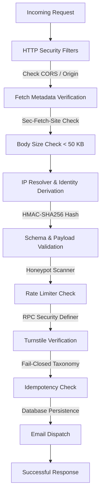

# MAA SITA INT UDHYOG — Security & Operations Manual

This document outlines the security specifications, data verification pipelines, database policies, logging architecture, and alerting sinks implemented in the application.

---

## 1. Request Lifecycle & Security Pipeline

Every dynamic request sent to `/api/contact` and `/api/quote` undergoes a secure, multi-stage validation pipeline before executing any business logic.

### Pipeline Components
1. **HTTP Security Filters**: Enforces POST method constraints, matching allowed domains (`ALLOWED_ORIGINS` and `PREVIEW_ALLOWED_ORIGINS`). No wildcard CORS headers. No credentials exposure.
2. **Fetch Metadata**: Inspects `Sec-Fetch-Site` and `Sec-Fetch-Mode` headers to block cross-site CSRF/state-mutation requests.
3. **Body Size Limitation**: Clamped strictly to `<= 50 KB` to prevent buffer overflow attacks.
4. **Identity Derivation**: derives client IP using a secure `HMAC-SHA256` hashing function seeded with `IP_HASH_SECRET`. This keeps the database GDPR-compliant (no plain-text IPs stored).
5. **Payload Validation**: Strict structure checks using Zod schemas.
6. **Honeypot Scanner**: Inspects hidden field `_hp`. If filled, records the bot hit in the honeypot bucket and returns a silent `200 Success` response without querying databases or Cloudflare Turnstile.
7. **Rate Limiter**: Queries the database via a Postgres RPC (`increment_rate_limit`) using security definer context.
8. **Cloudflare Turnstile**: Performs cryptographic challenge verification using a 6-result taxonomy.
9. **Idempotency Engine**: Identifies duplicate request submissions using standard UUIDs (`submission_id`) and hash fingerprinting.
10. **Data Persistence**: Safe write queries executed using the Supabase Service Role client.

---

## 2. Rate Limiting Policy

Rate limiting is enforced at the database level to prevent abuse and brute force attacks.

| Endpoint | Limit | Window | Table/Bucket |
| :--- | :--- | :--- | :--- |
| `/api/contact` | 5 submissions | 10 minutes | `rate_limits` |
| `/api/quote` | 3 submissions | 15 minutes | `rate_limits` |
| Honeypot Hit | 3 hits | 30 minutes | `rate_limits` |

If limits are exceeded, the API returns HTTP status `429 Too Many Requests`.

---

## 3. Database Security & Row Level Security (RLS)

All tables in the database are protected with Row Level Security (RLS) to enforce the principle of least privilege.

- **Anonymous Access Blocked**: The `anon` role is blocked from executing direct SELECT, INSERT, UPDATE, or DELETE queries on the `inquiries` and `quote_requests` tables.
- **Service Role Execution Only**: Data persistence queries are executed strictly using the `service_role` key from trusted backend Vercel Serverless Functions.
- **RPC Encapsulation**: The `increment_rate_limit` RPC runs with `SECURITY DEFINER` and uses a restricted `search_path = pg_catalog, public` to prevent privilege escalation.

---

## 4. Idempotency & Concurrency Controls

To prevent duplicate record insertion due to double-clicks or browser retry events, the API utilizes a dual safety loop:

1. **Submission Identifier**: The frontend generates a unique `submissionId` UUID per submission attempt. This UUID is preserved across network retry cycles.
2. **Request Fingerprint**: The API computes an `HMAC-SHA256` hash of normalized, key request fields (excluding Turnstile token and Honeypot parameters).
3. **Database Constraints**: The database enforces a `UNIQUE` constraint on the `request_fingerprint` column. If a duplicate fingerprint is submitted within a short window, the query fails gracefully with a `409 Conflict` (or silent `200` return).

---

## 5. CORS Preview Policies

To support secure validation in previews without introducing security leaks:

- **Explicit allowed origins**: Placed inside `PREVIEW_ALLOWED_ORIGINS`.
- **Strict Host Verification**: Wildcards (`*`) are disallowed.
- **No Credentials**: Requests from previews are blocked from attaching session-credentials or cookies, protecting against credentials leakage.

---

## 6. Data Privacy Consent Logging (DPDP Act)

In alignment with the Indian Digital Personal Data Protection (DPDP) Act:

- Forms require an explicit, un-checked checkbox consent prior to submission.
- Consent state, timestamp, and unique `submission_id` are permanently stored alongside user data.
- Personal data is redacted in application server logs.

---

## 7. Logging & Operations Alerting

The application employs a structured, security-conscious JSON logger.

### Log Redaction Policies
To prevent PII (Personally Identifiable Information) leaks:
- The logger automatically redacts sensitive fields like `name`, `phone`, `email`, `message`, `projectLocation` and `turnstileToken` using a custom redaction map.

### Event Taxonomy
Logs include standard level hierarchies:
- **INFO**: Standard lifecycle tracking (successful submission, server startup).
- **WARN**: Security events, validation failures, rate limit hits, honeypot blocks.
- **ERROR**: Database outages, Turnstile verification failures, system faults.

### Alerting & Monitoring Setup
1. **Structured Log Stream**: Serverless logs are forwarded to a central log management dashboard (e.g., Datadog, Logflare, or Vercel Axiom).
2. **Alert Sinks**: Configure alert metrics in your log management platform:
   - **Severe Errors**: Trigger alerts on any `ERROR` log level.
   - **Brute Force Detection**: Trigger alerts if a single IP generates more than 10 `WARN` logs for rate limit hits or validation failures within 5 minutes.
   - **Honeypot Logs**: Trigger warnings on multiple honeypot block events within short intervals, signaling coordinated bot scanners.
